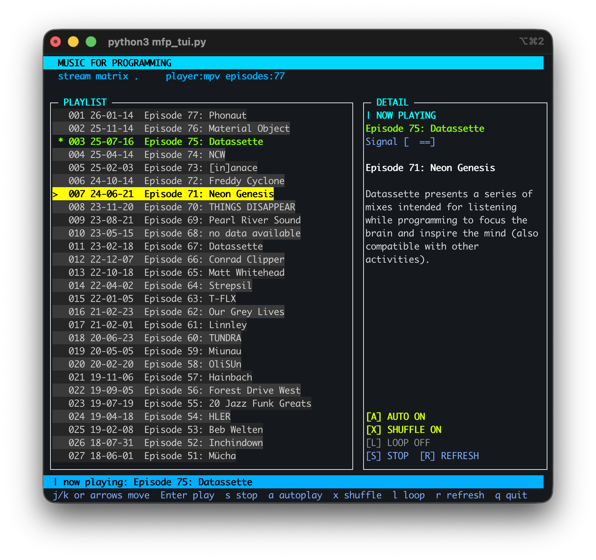

# MusicForProgramming TUI

<p align="center">
  
</p>

`musicforprogramming.net` のエピソードをターミナルで一覧・再生する TUI アプリです。

## Requirements

- macOS (MacBook Air想定)
- Python 3.9+
- 256色対応ターミナル推奨（iTerm2 / kitty / WezTerm など）
- 再生コマンド
  - 推奨: `mpv` (`brew install mpv`)
  - 代替: macOS 標準 `afplay`

## Run

```bash
python3 mfp_tui.py
```

## Keys

- `j` / `↓`: 次のエピソード
- `k` / `↑`: 前のエピソード
- `g`: 先頭へ
- `G`: 末尾へ
- `Enter`: 再生
- `s`: 停止
- `r`: フィード再取得
- `a`: 連続再生 ON/OFF
- `x`: シャッフル ON/OFF
- `l`: ループ切替 (`off -> all -> one`)
- `q` or `Esc`: 終了

## Notes

- RSS は `https://musicforprogramming.net/rss.xml` を優先し、失敗時に `rss.php` へフォールバックします。
- `afplay` 使用時は安定再生のため一時ファイルへダウンロードしてから再生します。
- 連続再生がONのとき、再生終了後に次の曲を自動再生します。
- シャッフルONのとき、次曲はランダムに選ばれます（1曲のみの場合を除く）。
- ループは `off` / `all` / `one` を切り替えできます。
